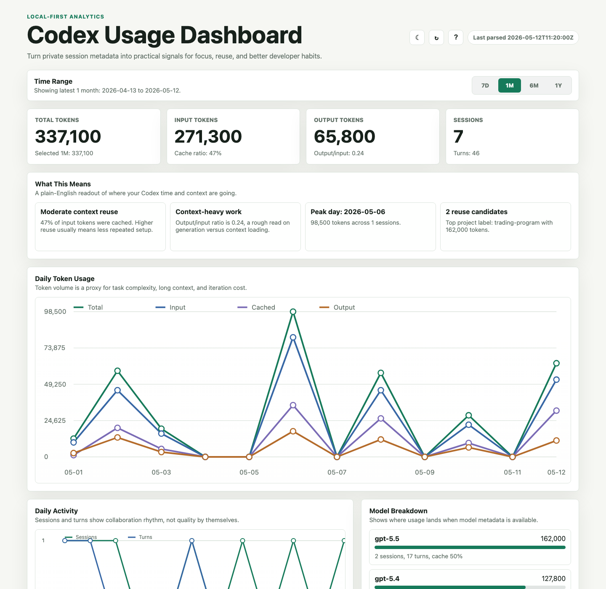
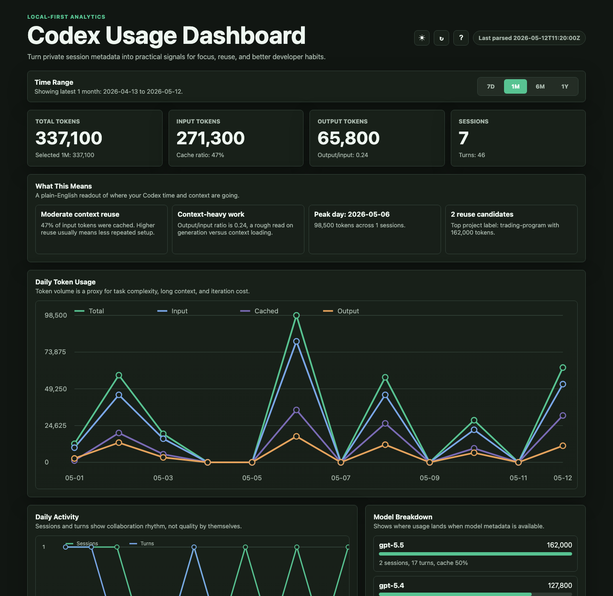
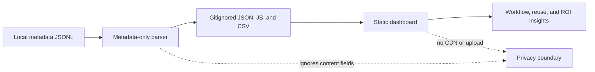

# Codex Usage Dashboard

A local-first, privacy-preserving analytics dashboard for Codex session metadata. It parses token counters from local JSONL records, writes local JSON/CSV outputs, and renders a polished static dashboard with charts, tables, and practical developer-improvement signals.

The project is designed to be portfolio-ready while staying safe to run on a personal or company-managed laptop: no uploads, no trackers, no remote CDN dependencies, and no prompt or response text persisted.

## Table Of Contents

- [Screenshots](#screenshots)
- [What It Shows](#what-it-shows)
- [Privacy Model](#privacy-model)
- [Quick Start](#quick-start)
- [Run Modes](#run-modes)
- [Directory Structure](#directory-structure)
- [File Guide](#file-guide)
- [Generated Outputs](#generated-outputs)
- [Supported Sources](#supported-sources)
- [Theme And Preferences](#theme-and-preferences)
- [Security Checks](#security-checks)
- [Repository Defaults](#repository-defaults)
- [Development](#development)
- [Documentation](#documentation)
- [Limitations](#limitations)

## Screenshots

The screenshots below are generated from synthetic sample data in `tests/sample_data/`.





## What It Shows

- Daily total, input, cached input, and output tokens.
- Time range toggle for the latest 7 days, 1 month, 6 months, or 1 year.
- Daily session and turn counts.
- Rolling 7-day token totals.
- Largest sessions by total tokens.
- Project and model breakdowns when metadata is available.
- Cache effectiveness: `cached_input_tokens / input_tokens`.
- Output/input ratio to separate generation-heavy work from context-heavy work.
- Memory reuse signals for repeated high-token projects and metadata-detected memory citations.
- Data freshness and privacy status cards.



The goal is not to grade the developer. The dashboard helps answer practical questions:

- Which projects repeatedly consume the most context?
- Are high-token sessions producing reusable docs, tests, scripts, memories, or skills?
- Is context reuse improving over time?
- Are long loops caused by missing tests, scattered project knowledge, or unclear setup?

## Privacy Model

- Local only.
- No network calls from the app.
- No remote CDN scripts or styles.
- No prompt, response, or conversation text persisted.
- No secrets, credential stores, browser profiles, `.env` files, SSH keys, or production credentials read.
- Default reads are limited to:
  - `~/.codex/sessions`
  - `~/.codex/archived_sessions`
- Generated real usage data is ignored by git.
- Paths and session IDs are redacted by default.

See [docs/SECURITY_AND_PRIVACY.md](docs/SECURITY_AND_PRIVACY.md) for the full data boundary.

## Quick Start

On macOS, double-click:

```text
quickstart.command
```

The quickstart builds live local data, starts a tokenized localhost server, opens the dashboard, and asks the server to shut down shortly after the page closes.

Terminal quickstart:

```bash
python install.py --quickstart --project-names
```

Use sample data first:

```bash
python install.py --sample --project-names --start-server
```

Build from local Codex metadata:

```bash
python install.py --real --project-names --start-server
```

Stop the background server:

```bash
python install.py --stop-server
```

Check server status:

```bash
python install.py --server-status
```

## Run Modes

| Mode | Command | Use when |
| --- | --- | --- |
| Open file directly | `python install.py --sample --project-names` then open `web/index.html` | You want a zero-server static dashboard. |
| Quickstart server | `python install.py --quickstart --project-names` | You want live local refresh, help API, browser open, and auto-shutdown. |
| Background server | `python install.py --real --project-names --start-server` | You want a local server that survives the current terminal. |
| Foreground server | `python install.py --real --serve` | You are developing and want logs in the terminal. |
| Scheduled refresh | `python scripts/schedule_dashboard.py --target launchd` | You want the dashboard data regenerated on a schedule. |

## Directory Structure

```text
.
├── .github/
│   ├── dependabot.yml
│   └── workflows/
├── docs/
│   ├── assets/
│   ├── CODEX_BUILD_PROMPT.md
│   ├── REPOSITORY_DEFAULTS.md
│   ├── SECURITY_AND_PRIVACY.md
│   ├── USAGE.md
│   └── ...
├── scripts/
│   ├── build_usage_data.py
│   ├── check_repo_security.py
│   ├── privacy_audit.py
│   ├── schedule_dashboard.py
│   └── serve_dashboard.py
├── tests/
│   ├── fixtures/
│   ├── sample_data/
│   └── test_*.py
├── web/
│   ├── app.js
│   ├── index.html
│   └── styles.css
├── install.py
├── install.sh
├── quickstart.command
├── quickstart.sh
├── quickstart.bat
├── CONTRIBUTING.md
├── LICENSE
├── Pipfile
├── pyproject.toml
├── README.md
└── SECURITY.md
```

## File Guide

| Path | Purpose |
| --- | --- |
| `install.py` | Cross-platform command entrypoint for building data, starting/stopping the server, and quickstart mode. |
| `install.sh` | POSIX wrapper around `install.py`. |
| `quickstart.command` | macOS double-click launcher. Must be executable for Finder launch. |
| `quickstart.sh` | POSIX quickstart wrapper. |
| `quickstart.bat` | Windows quickstart wrapper. |
| `scripts/build_usage_data.py` | Metadata-only parser and data generator. |
| `scripts/serve_dashboard.py` | Token-aware localhost static server plus local help/refresh APIs. |
| `scripts/schedule_dashboard.py` | Prints or installs local scheduled-refresh commands. |
| `scripts/privacy_audit.py` | Verifies generated outputs do not contain forbidden text patterns. |
| `scripts/check_repo_security.py` | Repo-wide artifact checker for text files, shell/batch scripts, HTML/CSS/JS, structured files, PNG assets, and executable modes. |
| `docs/CODEX_BUILD_PROMPT.md` | Sanitized copy/paste prompt for recreating or adapting the project with Codex. |
| `docs/REPOSITORY_DEFAULTS.md` | Default files, checks, and GitHub settings to reuse for local-first portfolio repos. |
| `.github/workflows/ci.yml` | GitHub Actions workflow for linting, tests, privacy audit, and artifact security checks. |
| `.github/workflows/codeql.yml` | GitHub CodeQL code scanning workflow for Python and JavaScript. |
| `.github/dependabot.yml` | Dependabot updates for GitHub Actions and Python dependency metadata. |
| `SECURITY.md` | Vulnerability reporting policy and maintainer security checklist. |
| `CONTRIBUTING.md` | Contributor setup, privacy rules, and pull-request checklist. |
| `LICENSE` | MIT license for reuse. |
| `web/index.html` | Static dashboard shell. |
| `web/styles.css` | Responsive light/dark product styling. |
| `web/app.js` | Browser-only rendering, charts, local preferences, help dialog, refresh, and lifecycle hooks. |
| `tests/fixtures/` | Minimal deterministic parser fixtures, including a synthetic content sentinel used to prove content is not persisted. |
| `tests/sample_data/` | Rich synthetic data used for portfolio screenshots and demo dashboards. |
| `docs/assets/` | Safe sample screenshots generated from synthetic data. |
| `data/generated/` | Local generated JSON/CSV/JS outputs. Ignored by git. |
| `.local/` | Local server state, logs, and temporary browser screenshot profiles. Ignored by git. |

## Generated Outputs

Generated files live in `data/generated/`:

- `codex_usage_summary.json`
- `codex_usage_summary.js`
- `codex_usage_daily.csv`
- `codex_usage_sessions.csv`

`data/generated/` is gitignored because real usage metadata can reveal local work patterns, project labels, model usage, and timing.

## Supported Sources

Codex is supported by default:

```bash
python scripts/build_usage_data.py --source codex
```

List known source adapters:

```bash
python scripts/build_usage_data.py --list-sources
```

Current posture:

- `codex`: supported, default metadata roots.
- `claude`: experimental opt-in for local JSONL roots when present.
- `gemini`: experimental opt-in for local JSONL roots when present.
- `chatgpt`: manual root required because this project does not assume a stable metadata-only desktop export path.

Use explicit roots for controlled local experiments:

```bash
python scripts/build_usage_data.py --input-root /path/to/metadata-jsonl
```

Avoid pointing the parser at broad home, app, browser, credential, or production directories.

## Theme And Preferences

The dashboard includes a day/night theme toggle. It stores only non-sensitive UI preferences in browser `localStorage`:

- `theme`
- selected deep-dive kind
- selected deep-dive item

No tokens, session content, generated data, or file paths are stored in browser preference state. Preferences are local to the browser profile and can be cleared from browser site data.

## Security Checks

Run the full local check suite:

```bash
pipenv run ruff format --check .
pipenv run ruff check .
pipenv run pyright
pipenv run bandit -r install.py scripts -c pyproject.toml
pipenv run pip-audit
pipenv run python -m unittest discover -s tests
pipenv run python scripts/privacy_audit.py --forbid SYNTHETIC_PROMPT_TEXT_SHOULD_NOT_APPEAR
pipenv run python scripts/check_repo_security.py
node --check web/app.js
sh -n quickstart.command quickstart.sh install.sh
git diff --check
```

`scripts/check_repo_security.py` is intentionally repo-wide, not Python-only. It checks:

- secret-like patterns in committed text artifacts
- structured file parseability for JSON, JSONL, TOML, and lock files
- HTML remote runtime references, inline event handlers, and `javascript:` URLs
- CSS remote imports and dangerous legacy expressions
- JavaScript dynamic-code sinks such as `eval`, `new Function`, and `document.write`
- shell and batch scripts for risky network/destructive patterns
- PNG screenshot headers
- expected executable bits for local launch scripts

The localhost server also:

- binds to loopback by default
- refuses non-loopback hosts unless explicitly allowed
- serves only `web/` and `data/generated/`
- blocks traversal, hidden files, and directory listing
- sends CSP, MIME-sniffing, frame-blocking, referrer-policy, and cache-control headers
- uses fixed subprocess argument lists instead of shell command strings
- requires a random quickstart token for tokenized local API calls

This hardens the local app, but it is not a substitute for an internet-facing production security program. Do not expose the server publicly.

## Repository Defaults

This repo includes the default public-repo hygiene files that should be carried into similar projects:

- MIT `LICENSE`
- `SECURITY.md`
- `CONTRIBUTING.md`
- GitHub Actions CI
- CodeQL code scanning
- Dependabot configuration
- issue and pull-request templates with privacy/security reminders
- repo-wide artifact security checks

See [docs/REPOSITORY_DEFAULTS.md](docs/REPOSITORY_DEFAULTS.md).

## Development

This project has no runtime package dependencies. Development tooling is managed with Pipenv:

```bash
pipenv --python 3.12
pipenv install --dev
```

Generate sample screenshots:

```bash
python install.py --sample --project-names
```

Then open `web/index.html` or use a local static server.

## Documentation

- [One pager](docs/ONE_PAGER.md)
- [Reusable Codex build prompt](docs/CODEX_BUILD_PROMPT.md)
- [Repository defaults](docs/REPOSITORY_DEFAULTS.md)
- [Project plan](docs/PROJECT_PLAN.md)
- [Technical design](docs/TECHNICAL_DESIGN.md)
- [Implementation plan](docs/IMPLEMENTATION_PLAN.md)
- [Security and privacy](docs/SECURITY_AND_PRIVACY.md)
- [Usage](docs/USAGE.md)
- [Operations](docs/OPERATIONS.md)
- [Metrics guide](docs/METRICS_GUIDE.md)
- [Development](docs/DEVELOPMENT.md)

## Limitations

- The parser can only report metadata that local tools actually record.
- Token fields can vary across Codex, Claude, Gemini, and other local tools.
- ChatGPT desktop is not scanned automatically because app-private stores may contain conversation content.
- A local server cannot defend against a malicious process already running as the same OS user.
- Real generated data should stay local and out of commits unless intentionally anonymized.
