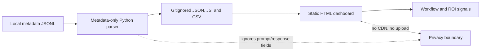

# Building Codex Stats: A Local-First Dashboard For Understanding AI Coding Usage

Subtitle: Turning local Codex metadata into private usage analytics, workflow insight, and a reusable portfolio project.

Suggested tags: `codex`, `local-first`, `python`, `javascript`, `developer-tools`, `privacy`, `github-actions`, `codeql`

Suggested cover idea: Use `docs/assets/dashboard-sample-dark.png` as the hero image. It is generated from synthetic sample data and is safe for public use.


## The problem

AI coding tools are becoming part of the daily developer workflow, but the visibility around their usage is still surprisingly thin.

I wanted to answer a few practical questions:

- Which projects are consuming the most Codex context?
- Are long sessions creating reusable value, or just repeating the same setup and debugging loops?
- Is cached context helping over time?
- Which sessions might deserve a better README, a project guide, a memory, or a reusable skill?
- Can I track this without sending local work metadata to another service?

That became **Codex Stats**, a local-first dashboard that parses local AI session metadata and turns it into charts, tables, and workflow signals.

Repo: `https://github.com/soumyajyotibiswas/codex-stats`

## What it does

Codex Stats reads local metadata records, extracts token counters and session-level fields, generates local JSON/CSV files, and renders a static browser dashboard.

It shows:

- total, input, cached input, and output tokens by day
- daily session and turn counts
- rolling 7-day token totals
- largest sessions by total tokens
- project and model breakdowns when metadata is available
- cache effectiveness
- output/input ratio
- high-token repeated project signals
- memory reuse signals when safely detectable from metadata
- data freshness and privacy status cards

It also includes range controls for 7 days, 1 month, 6 months, and 1 year, plus light and dark themes.


## The design constraint: useful, but private

The most important design decision was what the tool should **not** do.

Codex Stats does not upload data, does not use external APIs, does not load remote CDN scripts, and does not persist prompt or response text. The parser is metadata-only by design.

The default Codex read scope is intentionally narrow:

```text
~/.codex/sessions
~/.codex/archived_sessions
```

The generated real usage data stays local and is ignored by git:

```text
data/generated/
.local/
```

This matters because even usage metadata can reveal work patterns, project labels, timing, and tool choices. A dashboard like this should be honest about that boundary.

## Architecture

At a high level, the project is deliberately simple:



The parser is Python standard library. The dashboard is plain HTML, CSS, and JavaScript. There are no runtime package dependencies and no remote assets.

That choice keeps the project easy to inspect, easy to run, and easier to trust.

## The metrics need to mean something

A token dashboard can easily become vanity telemetry: big number goes up, chart looks nice, nothing changes.

The more useful question is: **what should the developer do differently after seeing this?**

Codex Stats tries to make the metrics actionable:

| Widget | What it means | How it helps |
| --- | --- | --- |
| Total tokens by day | Overall AI coding workload | Helps spot heavy build/debug/research days |
| Input tokens | Context sent into the model | Shows when sessions are context-heavy |
| Cached input tokens | Reused context | Indicates whether context reuse is improving |
| Output tokens | Generated response volume | Helps distinguish generation-heavy work from investigation-heavy work |
| Daily sessions | Number of Codex work sessions | Shows usage rhythm and fragmentation |
| Daily turns | Interaction depth | Helps spot long loops |
| Largest sessions | Biggest token consumers | Good candidates for review and reuse |
| Project breakdown | Cost by project label | Shows which repos need better setup/docs/tests |
| Model breakdown | Usage by model | Helps compare model choices over time |
| Cache ratio | `cached_input_tokens / input_tokens` | Measures context reuse efficiency |
| Output/input ratio | `output_tokens / input_tokens` | Separates writing-heavy sessions from context-heavy debugging |
| Memory reuse signals | repeated high-token work or memory metadata | Suggests future memories, skills, docs, or automation |

The ROI is not "use fewer tokens at all costs." The better goal is to turn repeated expensive work into reusable project knowledge.

If the same project repeatedly shows high-token sessions, that may mean:

- setup instructions are incomplete
- tests are missing or slow to discover
- project architecture is hard to reload into context
- local commands are not documented
- a recurring workflow deserves a script
- a recurring reasoning pattern deserves a Codex memory or skill

That is the actual value: the dashboard becomes a feedback loop for improving the developer environment.

## Running it

The project supports both sample data and real local metadata.

Run with synthetic sample data first:

```bash
python install.py --sample --project-names --start-server
```

Run against local Codex metadata:

```bash
python install.py --real --project-names --start-server
```

Stop the local background server:

```bash
python install.py --stop-server
```

Or use the macOS quickstart:

```text
quickstart.command
```

The quickstart builds local data, starts a tokenized localhost server, opens the dashboard, and asks the server to shut down shortly after the page closes.

## Local server hardening

The server is optional. You can generate data and open `web/index.html` directly.

When the server is used, it is intentionally local:

- binds to `127.0.0.1` by default
- serves only `web/` and `data/generated/`
- blocks traversal, hidden files, and directory listing
- uses a random quickstart token for local API calls
- adds CSP and other defensive browser headers
- uses fixed subprocess argument lists instead of shell command strings
- supports explicit shutdown and status commands

This is not meant to be deployed to the internet. It is a local developer tool.

## Repo hardening became part of the project

One useful side effect of building Codex Stats was turning "make it portfolio-ready" into a reusable repository-hardening checklist.

The repo includes:

- MIT license
- `SECURITY.md`
- `CONTRIBUTING.md`
- GitHub Actions CI
- Dependabot
- CodeQL code scanning through GitHub default setup
- branch protection
- GitHub rulesets for `main` and `v*` release tags
- issue and pull-request templates
- repo-wide artifact security checks

The CI is not Python-only. It checks Python, JavaScript syntax, shell wrappers, generated-data privacy boundaries, and committed artifact safety.

The repo-wide checker looks for things like:

- secret-like patterns
- remote runtime references
- risky shell and batch patterns
- unsafe HTML/JS patterns
- invalid structured files
- unexpected artifact types
- missing executable bits for local launch scripts

That mattered in practice. CodeQL found a clear-text logging issue in the repo security checker itself. The fix was to make the checker emit sanitized structured findings instead of raw values. The alert closed after the PR passed CI and CodeQL.

## What I would improve next

The current version is intentionally local and simple, but there are a few natural next steps:

- richer cross-tool adapters for Claude, Gemini, and ChatGPT exports when metadata-only sources are available
- better trend annotations for unusually high usage days
- more explicit "next best improvement" recommendations per project
- optional scheduled refresh setup
- a Streamlit or desktop-app version for users who want a richer local UI
- anonymized export mode for teams that want to compare workflow patterns without exposing project names

## Lessons learned

The biggest lesson was that personal AI usage metrics are only useful when they are connected to behavior change.

Daily token totals are interesting. Repeated high-token sessions on the same project are useful. Cache ratios are useful when they show whether context reuse is improving. Model breakdowns are useful when they inform future model choices.

The second lesson was security scope. A local dashboard can still leak information if it casually commits generated files, prints raw findings, loads remote scripts, or scans broad directories. Local-first does not automatically mean safe. It has to be designed that way.

The third lesson was repo hygiene. If a project is going into a public portfolio, hardening should be part of the product, not an afterthought.

Codex Stats started as a personal dashboard, but it became a reusable pattern: local metadata in, private insights out, public source code with synthetic fixtures only.

That feels like the right shape for a developer tool in the AI coding era.

