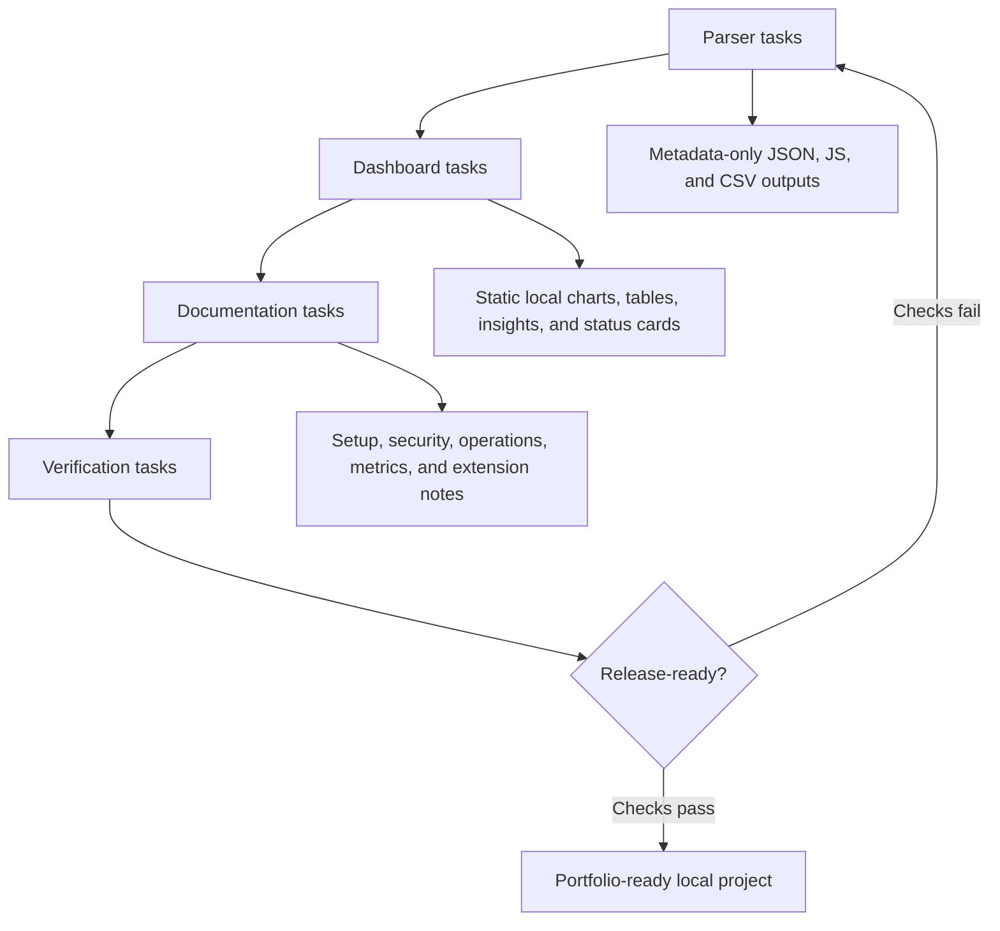

# Implementation Plan

## Parser tasks

- Discover JSONL files below allowlisted roots.
- Parse line by line with malformed record handling.
- Aggregate token usage from metadata only.
- Redact paths and session identifiers by default.
- Write JSON, JavaScript bridge, and CSV outputs.

## Dashboard tasks

- Build responsive layout.
- Add metric cards for total, input, cached, output, sessions, and turns.
- Render daily token and activity charts with inline SVG.
- Add project/model breakdowns.
- Add largest session table.
- Add memory reuse signal panel.
- Add privacy and freshness status cards.
- Add plain-English insight cards and metric definitions.

## Documentation tasks

- Document setup and reuse.
- Document security boundary.
- Document generated files.
- Document future extension points.
- Document server lifecycle and scheduled refresh options.
- Document how metrics map to developer self-improvement.

## Verification tasks

- Run Python syntax checks.
- Run unit tests on synthetic JSONL.
- Run parser dry-run against local Codex metadata.
- Run parser against local Codex metadata with redaction.
- Confirm generated files exist.
- Confirm generated outputs do not contain synthetic prompt text.
- Serve dashboard locally and request the HTML.
- Verify server start/status/stop lifecycle.
- Verify schedule command generation without installing a job.
