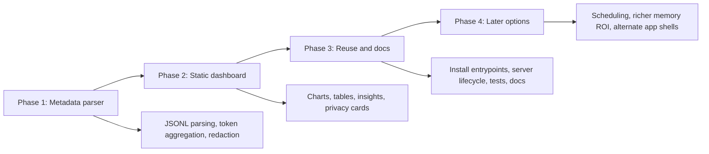

# Project Plan

## Goal

Build a local-first, privacy-preserving Codex Usage Dashboard that can be reused by cloning the repo and running a simple setup command.

## Phase 1: Metadata parser

- Read only explicit Codex session roots by default.
- Parse JSONL defensively.
- Extract only token/session metadata.
- Generate JSON and CSV outputs.
- Add dry-run support.

## Phase 2: Static dashboard

- Build a polished local HTML/CSS/JS dashboard.
- Render charts without external libraries.
- Support direct file opening through a generated local JavaScript data bridge.
- Show privacy and data freshness cards.
- Add plain-English insight cards and a metric guide so non-specialists understand the value.

## Phase 3: Reuse and docs

- Add `install.py` as the cross-platform entrypoint.
- Add `install.sh` for macOS/Linux convenience.
- Add background server start/stop/status commands.
- Add scheduled refresh command generation.
- Add project, technical, usage, and security docs.
- Add synthetic fixtures and tests.

## Phase 4: Later options

- Daily cron integration.
- Automatic dashboard refresh.
- Streamlit or local app version.
- Richer memory return-on-investment analysis.
- More portfolio polish and screenshots.
