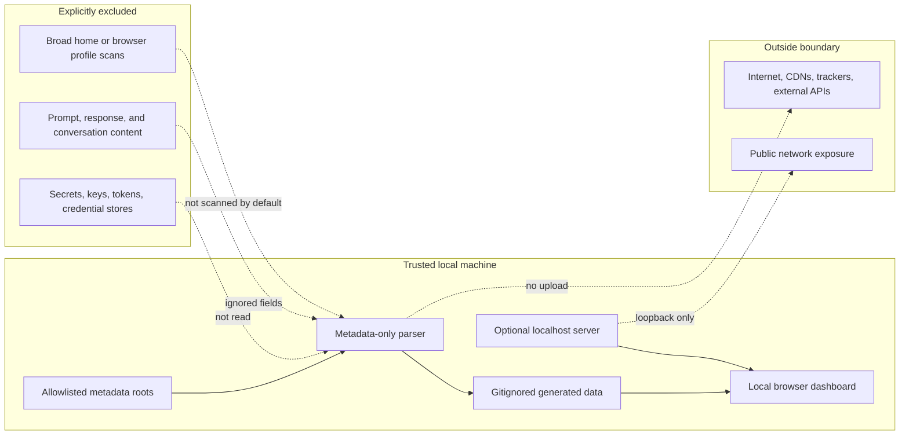

# Security And Privacy

## Core rules

This project is local-first and privacy-preserving by design.

- No network upload.
- No external APIs.
- No remote CDN dependencies.
- No prompt or response text persisted.
- No secrets or credential stores read.
- No background daemon by default.



## Default read scope

The parser reads only these default roots:

- `~/.codex/sessions`
- `~/.codex/archived_sessions`

You can pass `--input-root` for synthetic fixtures or controlled local experiments. Do not point it at broad directories.

## Ignored content fields

The parser intentionally ignores fields likely to contain conversation content, including:

- `payload.content`
- `payload.message`
- `payload.input`
- `payload.output`
- `payload.summary`
- `payload.text_elements`
- `payload.last_agent_message`
- `payload.stdout`
- `payload.stderr`

The parser may read a JSON object to inspect allowed metadata fields, but it does not persist or display these content fields.

## Written data

Generated files are written to `data/generated/`:

- `codex_usage_summary.json`
- `codex_usage_summary.js`
- `codex_usage_daily.csv`
- `codex_usage_sessions.csv`

This directory is ignored by git because real usage metadata can be private.

Operational state is written to `.local/`:

- `.local/server.json`
- `.local/server.log`
- `.local/scheduler.log`

This directory is ignored by git.

Browser preferences are stored in `localStorage` under a dashboard-specific key. The only values stored are non-sensitive UI preferences: theme, deep-dive type, and deep-dive selection. Generated data, raw paths, session content, and tokens are not stored in browser preference state.

## Path redaction

Path and session redaction is enabled by default. The generated dashboard uses labels such as `Project 1` and `Session 1`.

To keep local project names and raw paths in generated data, opt in explicitly:

```bash
python scripts/build_usage_data.py --no-redact-paths
```

Only use this for local analysis when the generated files will not be committed or shared.

## Memory reuse signals

Memory reuse detection uses metadata keys such as `payload.memory_citation`. It does not store citation text or surrounding conversation content.

## Portfolio guidance

Commit the source code, docs, and synthetic fixtures. Do not commit `data/generated/` from real local usage.

## Dependency posture

The project uses only the Python standard library and browser-native HTML/CSS/JavaScript. There are no package manager installs, no external runtime dependencies, and no CDN scripts.

## Local server hardening

The local server is designed for localhost use only, not internet exposure.

Protections:

- Binds to `127.0.0.1` by default.
- Refuses non-loopback hosts unless `--allow-non-loopback` is explicitly passed.
- Serves only `web/` and `data/generated/`.
- Blocks hidden files, traversal attempts, and directory listing.
- Adds Content Security Policy, frame blocking, MIME sniffing, and referrer-policy headers.
- Uses fixed subprocess argument lists for refresh/help APIs instead of shell commands.
- Requires a random quickstart token for tokenized local APIs.
- Escapes generated dashboard values before inserting them into HTML.
- Rejects oversized local API request bodies.

Limits:

- No local server can protect against a malicious process already running as the same user.
- Do not bind this server to a public interface.
- Do not commit generated real usage data.
- ChatGPT desktop and other app-private stores are not scanned automatically because they may contain content rather than metadata-only usage records.

## Repository artifact checks

Security checks are not limited to Python files. Run:

```bash
python scripts/check_repo_security.py
```

The checker reviews committed text artifacts, shell and batch scripts, HTML/CSS/JS, structured files, sample JSONL, screenshot PNG headers, and expected executable modes. It also flags secret-like patterns and remote runtime references.

This is a local guardrail for this portfolio project. It does not prove that every possible file format or future dependency is safe; add new checks when adding new artifact types.
