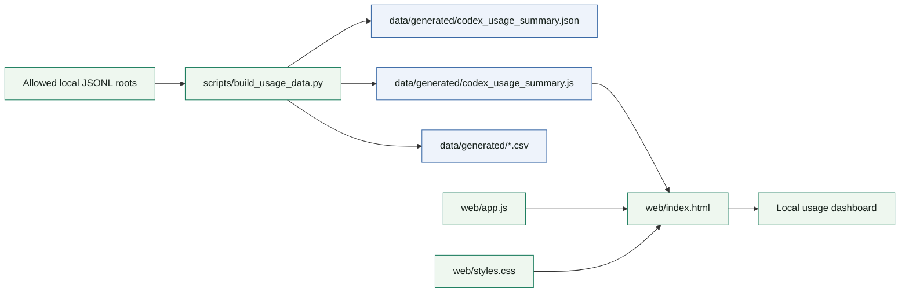
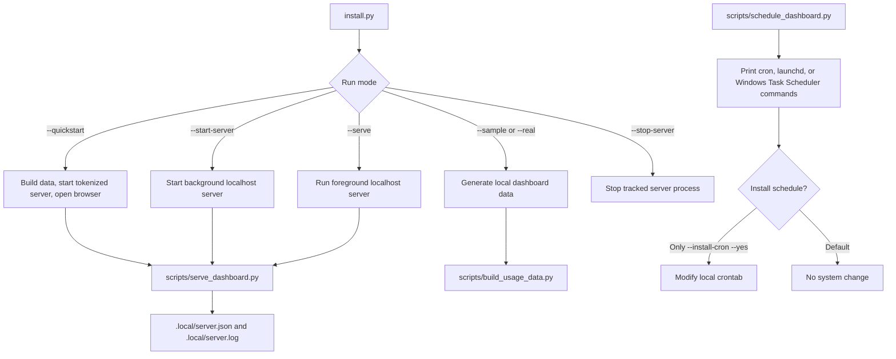
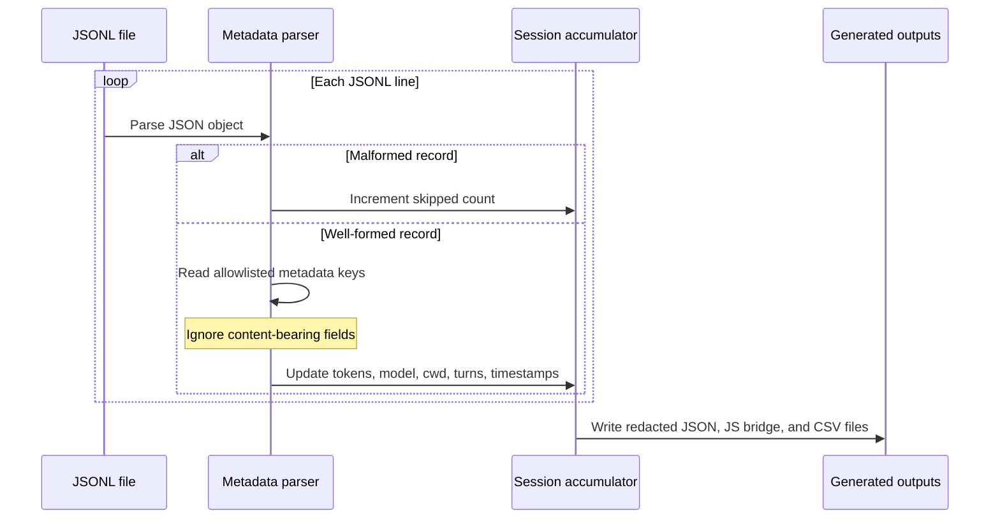
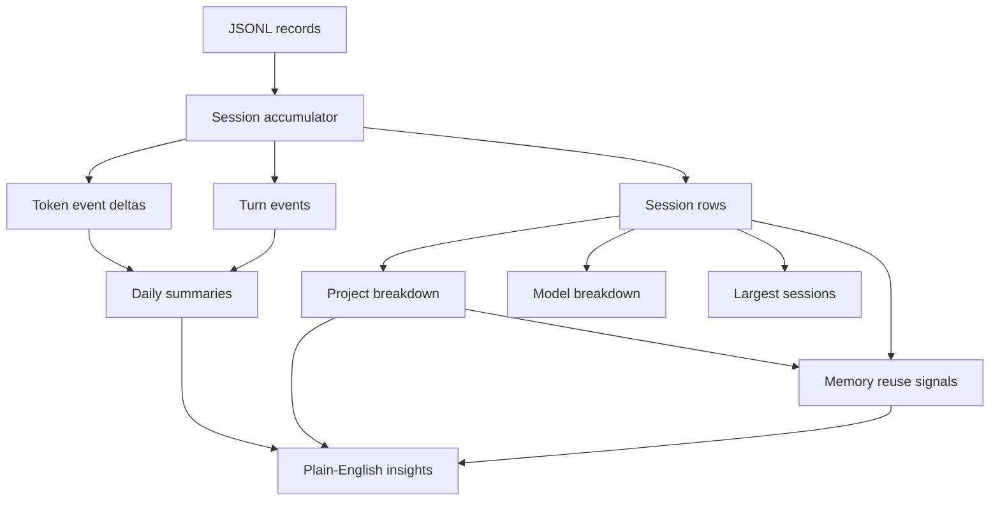
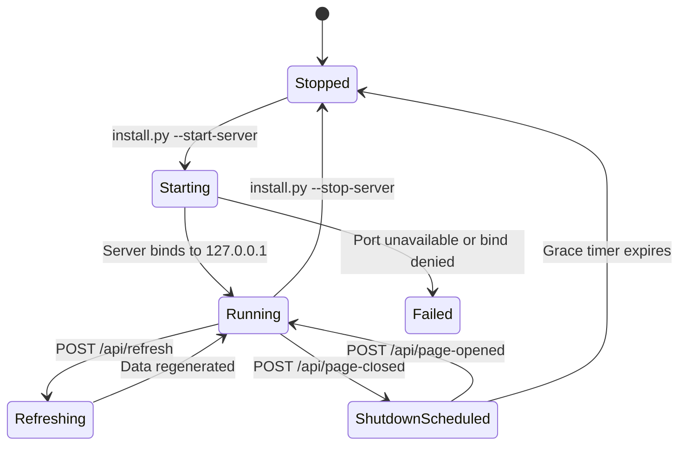

# Technical Design

## Architecture



Optional operations:



## Parser

The parser is implemented with the Python standard library. By default it reads only:

- `~/.codex/sessions`
- `~/.codex/archived_sessions`

It also supports explicit `--input-root` values for tests and sample fixtures.

## Metadata extraction

Allowed fields:

- top-level `timestamp`
- top-level `type`
- `payload.id` for session identity
- `payload.cwd` for project breakdown
- `payload.model` for model breakdown
- `payload.num_turns`
- `payload.memory_citation` presence
- `payload.info.total_token_usage.*`
- `payload.info.last_token_usage.*`

Ignored fields include conversation-bearing fields such as `content`, `message`, `input`, `output`, `summary`, and `text_elements`.



## Data model

Each JSONL file is treated as one usage session for analytics. This keeps the parser simple and avoids joining records across files by content or conversation text.



Generated session fields:

- `session_id`
- `source_file`
- `date`
- `last_updated_at`
- `project`
- `cwd`
- `model`
- `input_tokens`
- `cached_input_tokens`
- `output_tokens`
- `total_tokens`
- `turn_count`
- `token_events_count`
- `max_single_turn_total_tokens`
- `memory_citation_detected`

Daily summary fields:

- `date`
- `sessions`
- `turns`
- `input_tokens`
- `cached_input_tokens`
- `output_tokens`
- `total_tokens`
- `cache_ratio`
- `output_input_ratio`
- `rolling_7_day_total_tokens`

## Dashboard

The dashboard is static. It uses a generated `codex_usage_summary.js` file to support direct browser opening without a local HTTP server. When served through a local server, the same static files work unchanged.

No external JavaScript or CSS is loaded.

## Server lifecycle

The background server is a Python standard-library static server bound to `127.0.0.1`. It does not index data into memory and serves files directly from disk. Server state is stored in `.local/server.json`; logs are stored in `.local/server.log`.



Stop it with:

```bash
python install.py --stop-server
```

The server is optional; opening `web/index.html` directly works after data generation.

## Local API

When served locally, the dashboard can call:

- `GET /api/status`
- `GET /api/help`
- `POST /api/refresh`
- `POST /api/page-opened`
- `POST /api/page-closed`
- `POST /api/shutdown`

Tokenized quickstart mode appends a random token to the dashboard URL and requires that token for local API calls.

## Source registry

The parser has built-in source definitions for Codex, Claude, Gemini, and ChatGPT. Codex is enabled by default. Claude and Gemini are experimental opt-in JSONL roots. ChatGPT is manual-root-required because no stable metadata-only JSONL root is assumed.
